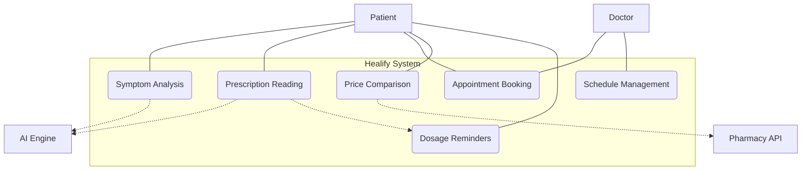

# Healify: Smart Healthcare Solution for Better Life

Healify is an AI-powered healthcare assistant web application designed to make medical support more accessible, intelligent, and user-friendly. By leveraging modern AI/ML technologies—including Optical Character Recognition (OCR), voice transcription, Large Language Models (LLMs), and geospatial mapping—Healify provides a comprehensive platform for symptom analysis, prescription management, and appointment coordination.

---

## 1. Problem Statement

Navigating the healthcare system is often a daunting task characterized by several systemic challenges:

- **Diagnostic Ambiguity:** Individuals frequently struggle to understand their symptoms or determine the urgency of medical intervention.
- **Prescription Complexity:** Handwritten or technical prescriptions are difficult to decipher, leading to potential errors in medication adherence.
- **Logistical Inefficiency:** Booking appointments with the right specialists in proximity is often a fragmented and time-consuming process.
- **Financial Transparency:** Significant price variations for the same medication across different pharmacies make healthcare more expensive for the average user.
- **Accessibility Barriers:** Lack of multilingual support and intuitive interfaces often excludes non-technical or non-English speaking populations from accessing digital healthcare.

---

## 2. Proposed Solution

Healify addresses these gaps by integrating Artificial Intelligence with real-time data services to provide a "single-pane-of-glass" experience for patient care.

- **Intelligent Triage:** AI-driven symptom analysis to provide preliminary health insights.
- **Automated Adherence:** OCR-based prescription reading that generates smart dosage reminders.
- **Unified Booking:** Integrated map services for locating clinics and booking instant or collaborative appointments.
- **Market Transparency:** Real-time medicine price comparison and generic drug suggestions.
- **Inclusive Design:** Voice-enabled, multilingual support for a truly accessible experience.

---

## 3. Core Features

### 🩺 AI Symptom Analyzer
Allows users to describe health concerns via text or voice. The system transcribes voice input (supporting various regional languages), analyzes the symptoms using an LLM, and provides potential conditions, severity levels (Low to Critical), and recommended next steps.

### 💊 Smart Prescription Reader
Users can upload photos of their prescriptions. The application uses Tesseract OCR and AI parsing to identify medications, dosages, and frequencies, automatically creating a structured medication schedule with browser-based reminders.

### 📅 Advanced Appointment Booking
A dual-mode booking system featuring:
- **Instant Doctor:** Quick access to available general practitioners.
- **Collaborative Appointments:** Specialized requests for specific medical departments.
- **Live Clinic Mapping:** Interactive maps using Overpass API to locate the nearest healthcare facilities.

### 💰 Medicine Price Lookup & Comparison
Fetches real-time pricing from pharmacy APIs to help users find the most affordable medicine. It also identifies cheaper generic alternatives for branded medications.

### 🤖 Site-Wide AI Accessibility Agent
A persistent assistant that guides users through the platform, assists in form-filling, and provides contextual help in multiple languages.

---

## 4. Use Case Diagram

---

## 5. Technology Stack

### Frontend
- **Framework:** React.js (v18+)
- **Routing:** React Router v6
- **Styling:** Vanilla CSS & CSS Modules
- **Mapping:** Leaflet.js & OpenStreetMap

### Backend
- **Environment:** Node.js & Express.js
- **Database:** MongoDB Atlas (Mongoose ODM)
- **Security:** JSON Web Tokens (JWT) & Bcrypt

### AI & External Services
- **LLM Engine:** Groq AI (Llama 3 / Mixtral)
- **Voice Services:** Sarvam AI (STT/TTS/Translation)
- **OCR Engine:** Tesseract.js
- **Data Scraping:** Cheerio / Puppeteer (for price lookup)

---

## 6. Implementation Challenges

### OCR Noise Mitigation
Handwritten prescriptions often lead to fragmented OCR output. We resolved this by passing the "noisy" text through an LLM parser that corrects misspellings and maps text to a structured JSON schema.

### Multilingual Latency
To ensure a smooth experience during voice transcription in regional languages, we implemented an asynchronous processing pipeline that provides immediate UI feedback while the Sarvam AI and Groq engines process data in parallel.

### Emergency Escalation Logic
Designing a severity assessment that accurately flags high-risk symptoms (like chest pain) required a dual-layer approach: keyword-driven red-flag detection combined with LLM-based probabilistic reasoning.

---

## 7. Development Team

- **Anindya Ganguly**
- **Arijeet Banerjee**
- **Rohan Debnath**
- **Priya Kumari**

---

> **Medical Disclaimer:** This application provides AI-generated health information for informational purposes only. It is not a substitute for professional medical advice, diagnosis, or treatment. Always seek the advice of your physician or other qualified health providers with any questions you may have regarding a medical condition.
